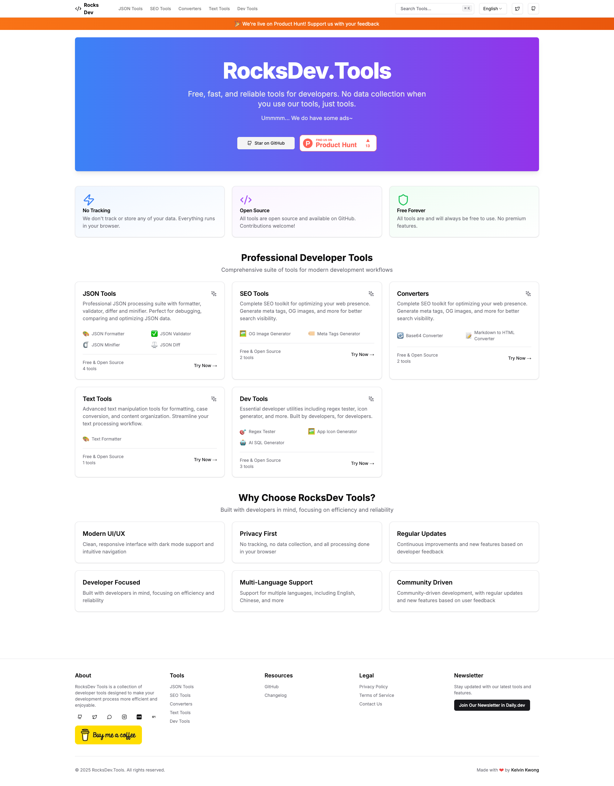

# RocksDev Tools

[](https://rocksdev.tools)

A comprehensive collection of developer tools built with modern web technologies. This project aims to provide free, fast, and reliable tools for developers.

[](https://rocksdev.tools)

<a href="https://www.buymeacoffee.com/tszhim_tech" target="_blank"></a>

<a href="https://www.producthunt.com/posts/rocksdev-tools?embed=true&utm_source=badge-featured&utm_medium=badge&utm_souce=badge-rocksdev&#0045;tools" target="_blank"></a>

## Project Blueprint

This project is built with modern web technologies and best practices:

- **Framework**: Next.js 15 with App Router
- **Language**: TypeScript
- **Styling**: Tailwind CSS
- **Component Library**: shadcn/ui
- **Form Validation**: Zod
- **Authentication**: NextAuth.js
- **Internationalization**: next-intl
- **State Management**: React Hook Form
- **HTTP Client**: Axios
- **Analytics**: Vercel Analytics
- **Ads Integration**: Google AdSense
- **Code Quality**: ESLint, Prettier
- **Git Hooks**: Husky
- **CI/CD**: GitLab CI
- **Containerization**: Docker

## Project Structure

```
.
├── app/
│   └── [locale]/              # Internationalized routes
│       ├── layout.tsx         # Root layout with providers
│       ├── page.tsx          # Homepage
│       └── tools/            # Developer tools
│           └── json/         # JSON tools
│               └── formatter/ # JSON formatter tool
│               └── validator/ # JSON validator tool
│               └── diff/      # JSON diff tool
│               └── minifier/  # JSON minifier tool
│           └── converters/   # Conversion tools
│               └── base64/   # Base64 converter tool
│           └── dev/          # Developer tools
│               └── regex/   # Regex tester tool
│           └── seo/          # SEO tools
│               └── og-image/ # OG image generator tool
│
├── components/
│   ├── tools/
│   │   ├── json-formatter # JSON formatter component
│   │   ├── json-validator # JSON validator component
│   │   ├── json-diff      # JSON diff component
│   │   ├── json-minifier  # JSON minifier component
│   │   └── base64         # Base64 converter component
│   │   └── regex          # Regex tester component
│   │   └── og-image       # OG image generator component
│   ├── layouts/
│   │   └── tool-layout   # Common tool layout
│   └── ui/                   # UI Components
│       ├── shadcn         # shadcn components
│
├── lang/                     # i18n translations
│   ├── en/
│   │   ├── common.json
│   │   └── json.json
│   │   └── converters.json
│   │   └── dev.json
│   │   └── seo.json
│   ├── zh-CN/
│   │   └── common.json
│   │   └── json.json
│   │   └── converters.json
│   │   └── dev.json
│   │   └── seo.json
│   ├── zh-HK/
│   │   └── common.json
│   │   └── json.json
│   │   └── converters.json
│   │   └── dev.json
│   │   └── seo.json
├── providers/
│   └── toast-provider.tsx    # Toast notifications provider
│
├── types/
│   └── next-auth.d.ts       # NextAuth type definitions
│
├── middleware.ts             # Next.js middleware
├── tsconfig.json            # TypeScript configuration
└── .env.example             # Environment variables template
```

## Development Phases

### Phase 1: Foundation Setup (2-3 weeks)

#### Technical Setup

- [x] Project initialization with Next.js 15
- [x] Core layout implementation
- [x] Ad space integration
- [x] Analytics setup
- [x] Error tracking
- [x] Performance monitoring

#### Core Features (MVP)

- [x] Responsive layout
- [x] Ad integration spaces
- [x] Analytics setup
- [ ] Basic SEO structure
- [x] Error tracking
- [x] Performance monitoring

### Phase 2: Initial Tools (1-2 weeks per tool)

#### JSON Tools

- [x] JSON Formatter
  - [x] Format/Validate functionality
  - [x] Copy/Download options
- [x] JSON Validator
  - [x] Format/Validate functionality
  - [x] Copy/Download options
- [x] JSON Diff
  - [x] Compare functionality
  - [x] Export result as JSON/CSV
  - [x] <u>Fix the table display issue</u>
- [x] JSON Minifier
  - [x] Minify functionality
  - [x] Copy/Download options

#### Conversion Tools

- [x] Base64 Encoder/Decoder
  - [x] Text encoding/decoding
  - [x] File encoding/decoding
  - [x] URL-safe encoding
- [ ] Markdown to HTML
- [ ] CSV to JSON

#### Developer Tools

- [x] Regular Expression Tester
  - [x] Live testing
  - [x] Common patterns library
  - [x] Match highlighting
- [ ] CSS Formatter/Minifier
- [ ] HTML Formatter/Validator

### Phase 3: Traffic Generation Tools (2-3 weeks)

#### SEO Tools Cluster

- [ ] Meta Tags Generator
- [ ] Robots.txt Generator
- [ ] XML Sitemap Generator
- [ ] SEO Analyzer
- [x] OG Image Generator (Open Graph Image)
  - [x] Support batch generation
  - [x] Support crop / resize

#### Text Processing Tools

- [ ] Text Formatter
- [ ] Case Converter
- [ ] Word Counter
- [ ] Markdown Editor

### Phase 4: Monetization & Growth (Ongoing)

#### Monetization

- [ ] Strategic ad placement
- [ ] Premium features (API access)

#### Marketing

- [ ] Technical blog posts
- [ ] Twitter/social presence
- [ ] DEV.to articles
- [ ] GitHub readme tools

#### User Experience

- [ ] Tool suggestions
- [ ] Recently used tools
- [x] Save preferences (dock)
  - [x] Dock drop out remove tool bug (Not able to remove tool from dock)
- [ ] Share configurations
- [x] Mobile menu

## Installed Libraries

### Core Dependencies

- `next`: ^15.0.3
- `react`: 19.0.0-rc.1
- `react-dom`: 19.0.0-rc.1
- `typescript`: ^5.x
- `next-auth`: ^4.24.7
- `next-intl`: ^3.23.5

### UI & Styling

- `@radix-ui/*`: UI primitives
- `tailwindcss`: ^3.4.14
- `class-variance-authority`: ^0.7.1
- `clsx`: ^2.1.1
- `tailwind-merge`: ^2.3.0
- `lucide-react`: ^0.372.0

### Form & Validation

- `zod`: ^3.23.8
- `react-hook-form`: ^7.53.2
- `@hookform/resolvers`: ^3.9.1

### Development Tools

- `prettier`: ^3.2.5
- `eslint`: ^8.x
- `husky`: ^9.0.11
- `typescript`: ^5.x

## Development

```bash
# Install dependencies
pnpm install

# Start development server
pnpm dev
```

## Docker Build

```bash
# Build Docker image
docker build -t dev-tools-hub .

# Run Docker container
docker run -p 3000:3000 dev-tools-hub
```

## Environment Variables

Create a `.env.local` file:

```env
NEXT_PUBLIC_API_URL=your_api_url
NEXT_PUBLIC_GA_ID=your_google_analytics_id
NEXT_PUBLIC_ADSENSE_ID=your_adsense_id
# Add other environment variables
```

## Contributing

See [CONTRIBUTING.md](.github/CONTRIBUTING.md)

## Star History

[](https://star-history.com/#kelvin6365/rocksdev.tools&Date)

## License

[MIT](https://choosealicense.com/licenses/mit/)
